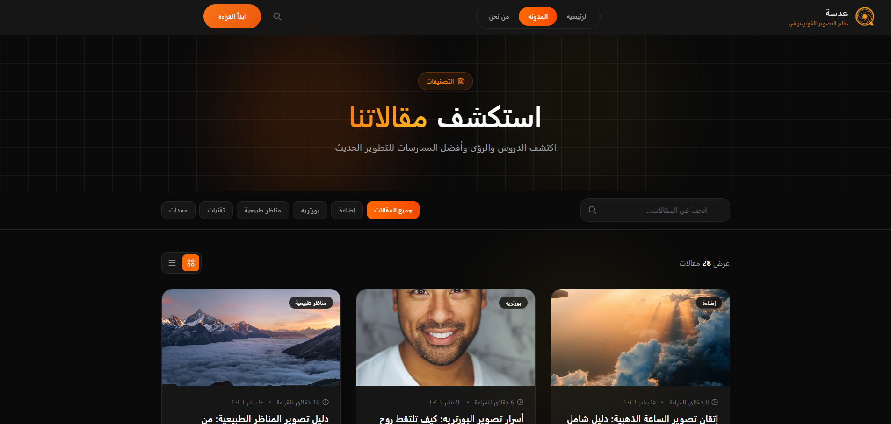

# 📸 Adasa — Photography Blog

Adasa is a modern Arabic photography blog built with **React.js**, focusing on practicing React fundamentals, component-based architecture, routing, dynamic filtering, searching, and reusable UI components.

The main goal of the project was not only to build a photography website, but to practice how to structure a React application and handle user interactions through reusable components and state-driven logic.

---

## 🚀 Live Demo

[https://shahendamohamed22.github.io/adasa/](#)

---

## 🛠️ Technologies Used

- React.js
- Vite
- React Router DOM
- Tailwind CSS
- Font Awesome
- JavaScript (ES6+)
- HTML5
- CSS3

---

## 📸 Screenshot



## ✨ Main Features

### 🏠 Home Page

The home page introduces the photography blog and provides navigation to the main sections of the application.

The UI is divided into reusable React components instead of keeping the entire page inside one component.

---

### 📝 Articles

The articles section displays photography-related posts from a local data structure.

Each article contains information such as:

- Title
- Excerpt
- Category
- Author
- Date
- Image
- Content

The data is rendered dynamically using JavaScript array methods instead of writing every article manually.

---

### 🔎 Search

Users can search for articles using the search input.

The search logic checks more than one property of each article:

```js
const searchArticles =
    article.title.toLowerCase().trim().includes(searchInput.toLowerCase().trim()) ||
    article.excerpt.toLowerCase().trim().includes(searchInput.toLowerCase().trim())
```

This allows the user to find an article by either its **title** or **excerpt**.

The input is normalized using `toLowerCase()` and `trim()` so the search is not affected by:

- Uppercase/lowercase differences
- Extra spaces

---

### 🏷️ Category Filtering

Articles can be filtered according to their category.

The project combines the category filter with the search condition:

```js
const filteredArticles = articles.posts.filter(article => {
    const selectedCategory =
        activeCategory === "all" ||
        article.category === activeCategory

    const searchArticles =
        article.title.toLowerCase().trim().includes(searchInput.toLowerCase().trim()) ||
        article.excerpt.toLowerCase().trim().includes(searchInput.toLowerCase().trim())

    return selectedCategory && searchArticles
})
```

This means an article must satisfy **both conditions**:

```text
Category matches
       +
Search matches
       ↓
Article is displayed
```

Selecting `"all"` removes the category restriction while keeping the search functionality active.

---

### 📄 Dynamic Article Details

Each article has its own page.

Instead of creating a separate page component for every article, the application uses **React Router** and dynamic route parameters.

The article ID is taken from the URL and used to find the corresponding article from the data.

This makes the same component reusable for different articles.

Example:

```text
/articles/1
/articles/2
/articles/3
```

The route parameter determines which article should be displayed.

---

### 🧭 Routing

The application uses **React Router** to handle navigation between pages.

The routing structure allows users to move between:

- Home
- Articles
- Article Details
- Other application pages
- 404 Not Found page

Navigation is handled on the client side without requiring a full page reload.

---

### 🧩 Reusable Components

The application is divided into reusable components to avoid repeating the same UI and logic.

Examples include:

- Navbar
- Footer
- Article Card
- Category Filter
- Search Input
- Article Details
- Section components

For example, the same `ArticleCard` component can receive different article data through props and render multiple articles dynamically.

---

## 🧠 React Concepts Practiced

This project focuses mainly on practicing React fundamentals and application logic.

### Components

Breaking the application into small reusable components instead of building large pages.

### Props

Passing article data and other values from parent components to child components.

### State

Using React state to control interactive values such as:

- Search input
- Selected category
- UI states

### Array Methods

Using JavaScript array methods to process and render data:

- `map()`
- `filter()`
- `find()`

### Conditional Rendering

Displaying different content depending on the current state or available data.

### React Router

Using routing and dynamic URL parameters to create multiple pages and article details.

### Derived Data

The displayed articles are not stored as a separate state.

Instead, they are calculated from the original articles data based on:

```text
Articles
   ↓
Category Filter
   ↓
Search Filter
   ↓
Filtered Articles
   ↓
Rendered Cards
```

This keeps the application state simpler and avoids storing duplicated data.

---

## 📁 Project Structure

```text
src/
│
├── components/
│   ├── Navbar/
│   ├── Footer/
│   └── ...
│
├── pages/
│   ├── Home/
│   ├── Articles/
│   ├── ArticleDetails/
│   └── NotFound/
│
├── data/
│   └── ...
│
├── assets/
│   └── ...
│
├── App.jsx
├── main.jsx
└── ...
```

The project structure separates:

- Reusable components
- Pages
- Data
- Assets
- Application routing

This makes the project easier to maintain and extend.

---

## ⚙️ How It Works

The main flow of the application can be summarized as:

```text
User opens the application
          ↓
React Router determines the page
          ↓
Page loads its required components
          ↓
Article data is rendered dynamically
          ↓
User searches or selects a category
          ↓
State changes
          ↓
Articles are filtered
          ↓
React re-renders the matching articles
```

For article details:

```text
User clicks an article
        ↓
Navigate to /articles/:id
        ↓
Read the ID from the URL
        ↓
Find the matching article
        ↓
Render Article Details
```

---

## 💻 Installation

Clone the repository:

```bash
git clone https://github.com/shahendamohamed22/adasa.git
```

Navigate to the project:

```bash
cd adasa
```

Install dependencies:

```bash
npm install
```

Start the development server:

```bash
npm run dev
```

Build the project:

```bash
npm run build
```

Run ESLint:

```bash
npm run lint
```

---

## 🎯 Learning Goals

This project was built to practice:

- React component architecture
- Reusable components
- Props
- State management
- Dynamic rendering
- Array methods
- Search functionality
- Category filtering
- Dynamic routing
- URL parameters
- Conditional rendering
- Responsive layouts
- Tailwind CSS

The focus was on understanding how **React logic connects user interactions with the rendered UI**, rather than relying on static pages.

---

## 👩‍💻 Author

**Shahenda Mohamed**

Frontend Developer | Electronics & Communications Engineering Student

- GitHub: [@shahendamohamed22](https://github.com/shahendamohamed22)

---

## 📄 License

This project was created for learning and educational purposes.